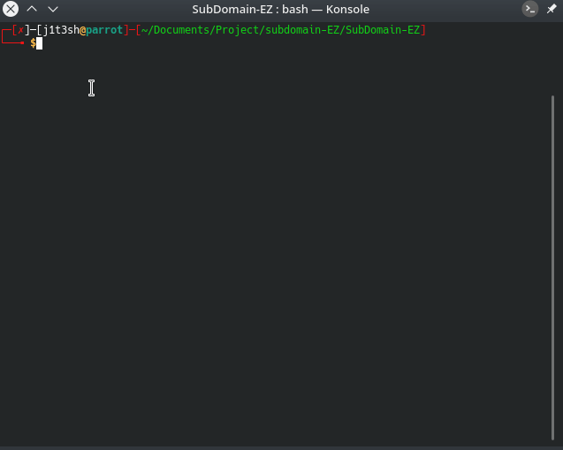
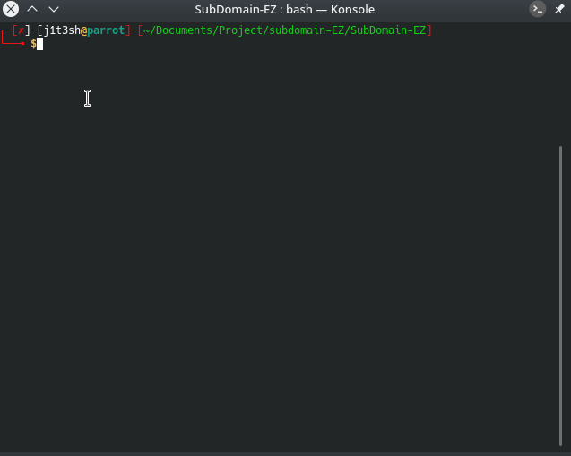

<h1 align="center">Sub-Z</h1>
<p align="center">A Complete Subdomain Enumeration Tool.</p><br>
<div align="center">

</div>

## Features:

- Find Subdomains in Seconds.
- Can Give you status code for every subdomain.
- Option for filter out only https website.
- Option to get IP for every SubDomain.
- Option for filter out only live Websites.

## Installation:

```
$ git clone https://github.com/j1t3sh/SUB-Z.git
$ chmod +x requirements.txt
$ sudo pip3 install -r requirements.txt
```

## Usage:

- **Default** `-d example.com` **(-d ,--domain is used for giving domain)**
```
$ python3 Sub-Z.py -d example.com
```


- **For Finding only https SubDomains. Use :** `-https`
```
$ python3 Sub-Z.py -d example.com -https
```



- **For Finding IP Addresses of the SubDomains. Use :** `-ip`
```
$ python3 Sub-Z.py -d example.com -ip
```



- **For Finding only Live SubDomains. Use :** `-live`
```
$ python3 Sub-Z.py -d example.com -live
```


- **Using all the above arguments.(From this you will get only live subdomains with https and IP for the same)**
```
$ python3 Sub-Z.py -d example.com -https -ip -live
```

